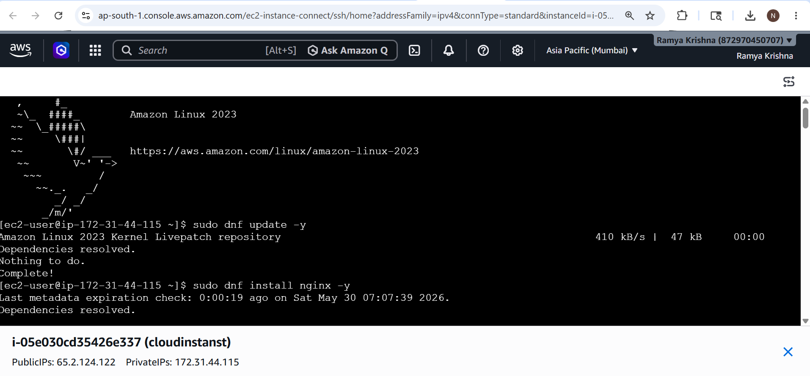
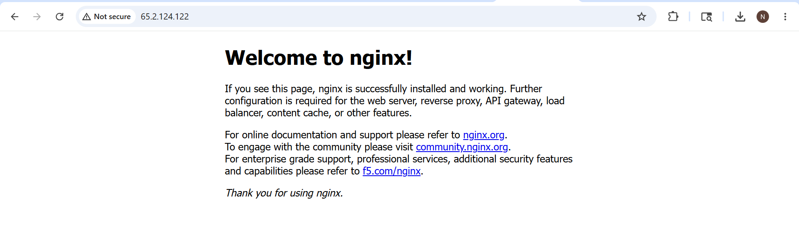
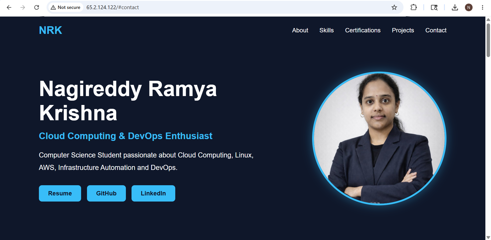

# 🌐 Cloud Portfolio Website

## 📌 Project Overview
This is my personal portfolio website built using HTML and CSS and deployed on a cloud platform using GitHub Pages. The project showcases my skills, profile information, and resume in a clean and responsive design.

---

## 🚀 Live Demo
👉 https://nagireddyramyakrishna.github.io/cloud-portfolio/

---

## 🛠️ Technologies Used
- HTML5
- CSS3
- GitHub Pages (Deployment)

---

## 🎯 Features
- Clean and modern portfolio UI
- Responsive layout for different screen sizes
- Profile section with image
- Resume download option
- Fully deployed on cloud (GitHub Pages)

---

## 📂 Project Structure

---
cloud-portfolio/
│
├── index.html
├── style.css
├── README.md
├── live-link.txt
│
├── assets/
│ ├── profile.jpeg
│ └── resume.pdf
│
└── screenshots/
├── ec2-linux.png
├── nginx-welcome.png
└── portfolio-live.png

## 🌍 Deployment Details
- Platform: GitHub Pages  
- Branch: master  
- Hosting Type: Static Website Hosting  
- Status: Successfully deployed and active  

---

## 📸 Screenshots

### 1. EC2 Linux Server Setup

### 2. Nginx Default Welcome Page

### 3. Portfolio Live Deployment

---

## 🎥 Demo Video
## 🎥 Demo Videos

### 1. EC2 Linux Setup
Demonstrates AWS EC2 instance creation, Linux commands, and server setup.

### 2. Portfolio Deployment
Shows final portfolio deployed and running successfully.

🔗 Video Links:
- EC2 Setup Video: https://drive.google.com/file/d/1447i8AL5z70dK2e-aMsb6rFcgx5IO7MC/view?usp=sharing  
- Live Portfolio Video: https://drive.google.com/file/d/1kNH64sZKyIMxOHx2V5dtaXIxZsfgL7SI/view?usp=sharing

---

## 📌 Live Link File
The live deployment link is also stored in:
- `live-link.txt`

---

## 👨‍💻 Author
**Nagireddy Ramya Krishna**

---

## 📌 Conclusion
This project demonstrates my ability to design and deploy a static website on a cloud platform using GitHub Pages. It reflects my understanding of web development and cloud deployment basics.